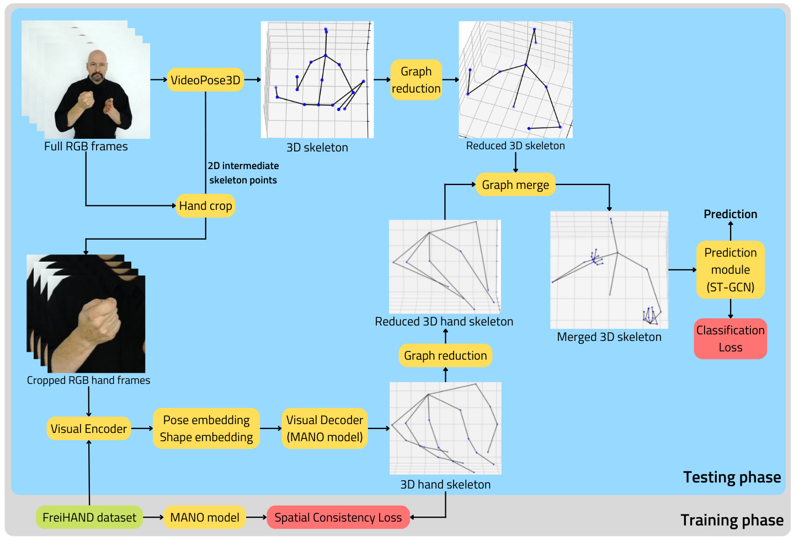

# SHrI3D

By Konrad Rydygier

This repository contains the official code prepared for the master's diploma thesis titled Word-Level Sign language Recognition using Neural Networks, written under supervision of dr inż. Witold Czajewski for Warsaw University of Technology, Faculty of electrical Engineering. 

The SHrI3D model is a PyTorch model, which explores the possibility of using 3D skeleton data as an input to the neural network. The architecture extracts the upper-body 3D skeletal data and predicts hand poses, which are connected to the body skeleton to be used for final prediction. Looking at the model's architecture, starting from the top, the upper-body flow, given a full RGB frame of a video, extracts 3D skeleton joints using a VideoPose3D model. The result is 17 3D points (x,y,z), which represent the whole body skeleton. The skeleton graph is reduced in such a way as to only represent points from the waist up, due to the leg joints being irrelevant to understanding signed words. Moving back to the beginning of the figure, the intermediate points of the VideoPose3D model, are used in the hand cropping pre-processing step, which uses full RGB frames and calculates the square crop based on the hand location. Then the cropped hand frames are used as an input to Visual Encoder, which produces pose and shape embeddings that are used by a Visual Encoder. The visual Encoder, based on the input, produces 3D hand joint points, which are reduced by preserving only the palm, base knuckle and fingertip joint points to reduce noise in the data. Next, the reduced hand points are joined together with 3D skeleton points. The resulting upper-body 3D skeleton is used as an input to the Prediction Module, which performs the final prediction.

Here are some examples of predicted skeletons:

Africa:

Blue:

Book:

Black:

Can:

Drink:

This code is inspired by and using code from the following sources:
- https://github.com/dxli94/WLASL
- https://github.com/facebookresearch/VideoPose3D
- https://github.com/hassony2/manopth
- https://github.com/yongqyu/st-gcn-pytorch

1. WLASL:
      - Download WLASL dataset and put all videos into WLASL2000 folder (https://github.com/dxli94/WLASL)
      - put WLASL_v0.3.json in SLR directory
2. VideoPose3D:
      - download VideoPose3D from https://github.com/facebookresearch/VideoPose3D
      - install detectron2 using instructions provided on VideoPose3D repository
      - set up VideoPose3D for inference in the wild according to the instruction
      - use VideoPose3D infer_video_2d.py class to generate data_2d_custom_wlasl.npz file with 2D skeleton predictions from video
      - put data_2d_custom_wlasl.npz in videopose3d_2d_data folder
3. Mano:
      - download mano models (https://mano.is.tue.mpg.de/) and put them inside ./mano/models
4. FreiHand:
      - download dataset from https://lmb.informatik.uni-freiburg.de/resources/datasets/FreihandDataset.en.html
      - put training/rgb images into FreiHAND/freihand_training_images
      - put evaluation/rgb_eval images into FreiHAND/freihand_evaluation_images
5. Train decoder:
      - run train_decoder.py class
6. Train st-gcn:
      - run st-gcn/main.py

NOTE: You can download data_2d_custom_wlasl.npz prepared by me from this link: https://drive.google.com/file/d/1Y216KKJqrGWkehRHxYD4n1GyscpEHqzR/view?usp=sharing
